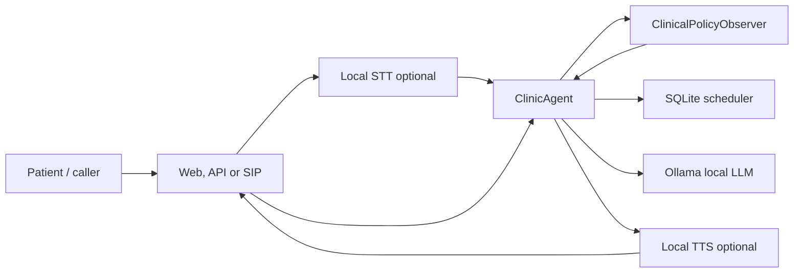
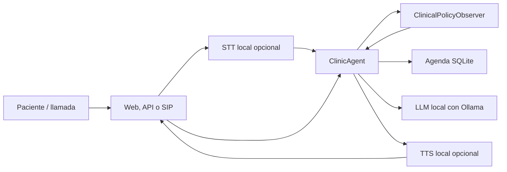

# VoiceClinic Local Agent

Local, self-hosted voice agent for patient appointment management. The project
is designed as an AI portfolio piece: it shows how to combine local LLMs, local
speech components, telephony integration, clinical guardrails and a simple
scheduling backend without relying on hosted voice-agent platforms.

This is a demo system. It is not medical software and must not be used to manage
real patients without proper clinical, legal, privacy and security review.

## English

### What it does

VoiceClinic handles common front-desk workflows for a healthcare clinic:

- books appointments;
- reschedules existing appointments;
- cancels appointments;
- answers basic administrative questions;
- detects high-risk clinical situations through a separate guardrail observer;
- exposes the same agent logic through a web demo, REST API and local telephony bridge.

### Architecture at a glance



Main components:

- **FastAPI** for the backend and web demo.
- **SQLite** for demo patients, doctors, slots and appointments.
- **Ollama or OpenAI** through a provider abstraction.
- **LangGraph** as an optional orchestration layer compatible with LiveKit's
  LangChain adapter.
- **faster-whisper** for optional local speech-to-text.
- **Piper** for optional local text-to-speech.
- **Asterisk + AudioSocket** for local SIP calls from a softphone.
- **LiveKit-ready design** with a message-based LangGraph graph for a future
  WebRTC/SIP path.

### Quick start

Requirements:

- Python 3.11 or newer. Python 3.12 is recommended.
- Ollama, if you want LLM-based intent extraction.
- Docker, only if you want the containerized stack.

If your system uses `python3` or `py -3.12` instead of `python`, use that command
in the examples below.

```bash
python scripts/dev.py copy-env
python scripts/dev.py setup
python scripts/dev.py reset-db
python scripts/dev.py api
```

Open:

```text
http://127.0.0.1:8000/demo/
```

Text-only mode:

```bash
python scripts/dev.py chat
```

Recommended Ollama model:

```bash
ollama pull qwen3:30b
```

### Documentation

- [Setup](docs/SETUP.md): local, voice, Docker and telephony setup.
- [Platform Notes](docs/PLATFORM_NOTES.md): Windows, macOS, Linux and CUDA notes.
- [Architecture](docs/ARCHITECTURE.md): components, flows and design decisions.
- [Azure Architecture](docs/AZURE_ARCHITECTURE.md): Azure Container Apps, Functions and DevOps target.
- [Microservices](docs/MICROSERVICES.md): service boundaries and migration path.
- [LiveKit + LangGraph](docs/LIVEKIT_LANGGRAPH.md): message-based graph and LLMAdapter integration.
- [API](docs/API.md): REST endpoints and example requests.
- [Guardrails](docs/GUARDRAILS.md): clinical observer pattern and policy categories.
- [Demo Script](docs/DEMO_SCRIPT.md): portfolio-ready demo flow.
- [Roadmap](docs/ROADMAP.md): current scope and next iterations.

### Validation

```bash
python scripts/dev.py test
python scripts/dev.py lint
```

Current test coverage focuses on scheduling transactions, agent behavior and
clinical guardrails.

### References

- LiveKit local server: https://docs.livekit.io/transport/self-hosting/local/
- LiveKit SIP self-hosted: https://docs.livekit.io/transport/self-hosting/sip-server/
- LiveKit observer-pattern guardrails: https://livekit.com/blog/observer-pattern-voice-agent-guardrails
- LiveKit LangChain adapter: https://livekit.com/blog/langchain-to-livekit
- LiveKit LangChain integration guide: https://docs.livekit.io/agents/models/llm/langchain/
- Asterisk AudioSocket: https://docs.asterisk.org/Configuration/Channel-Drivers/AudioSocket/
- faster-whisper: https://github.com/SYSTRAN/faster-whisper
- Piper: https://github.com/OHF-Voice/piper1-gpl

## Español

### Qué hace

VoiceClinic cubre flujos habituales de recepción en una clínica:

- reserva citas;
- cambia citas existentes;
- cancela citas;
- responde consultas administrativas básicas;
- detecta situaciones clínicas de riesgo mediante un observador de guardrails;
- expone la misma lógica por demo web, API REST y puente de telefonía local.

### Arquitectura en resumen



Componentes principales:

- **FastAPI** para backend y demo web.
- **SQLite** para pacientes, doctores, huecos y citas de demostración.
- **Ollama u OpenAI** mediante una abstracción de provider.
- **LangGraph** como capa opcional de orquestación compatible con el adaptador
  LangChain de LiveKit.
- **faster-whisper** para transcripción local opcional.
- **Piper** para síntesis de voz local opcional.
- **Asterisk + AudioSocket** para llamadas SIP locales desde un softphone.
- **Diseño preparado para LiveKit** con un grafo LangGraph basado en mensajes
  como evolución futura hacia WebRTC/SIP.

### Inicio rápido

Requisitos:

- Python 3.11 o superior. Se recomienda Python 3.12.
- Ollama, si quieres extracción de intención basada en LLM.
- Docker, solo si quieres levantar el stack en contenedores.

Si tu sistema usa `python3` o `py -3.12` en lugar de `python`, usa ese comando en
los ejemplos siguientes.

```bash
python scripts/dev.py copy-env
python scripts/dev.py setup
python scripts/dev.py reset-db
python scripts/dev.py api
```

Abre:

```text
http://127.0.0.1:8000/demo/
```

Modo solo texto:

```bash
python scripts/dev.py chat
```

Modelo recomendado para Ollama:

```bash
ollama pull qwen3:30b
```

### Documentación

- [Instalación](docs/SETUP.md): configuración local, voz, Docker y telefonía.
- [Notas de plataforma](docs/PLATFORM_NOTES.md): Windows, macOS, Linux y CUDA.
- [Arquitectura](docs/ARCHITECTURE.md): componentes, flujos y decisiones técnicas.
- [Arquitectura Azure](docs/AZURE_ARCHITECTURE.md): objetivo con Azure Container Apps, Functions y DevOps.
- [Microservicios](docs/MICROSERVICES.md): límites de servicio y camino de migración.
- [LiveKit + LangGraph](docs/LIVEKIT_LANGGRAPH.md): grafo basado en mensajes e integración con LLMAdapter.
- [API](docs/API.md): endpoints REST y ejemplos de petición.
- [Guardrails](docs/GUARDRAILS.md): patrón de observador clínico y categorías de política.
- [Guion de Demo](docs/DEMO_SCRIPT.md): recorrido listo para portfolio.
- [Roadmap](docs/ROADMAP.md): alcance actual y siguientes iteraciones.

### Validación

```bash
python scripts/dev.py test
python scripts/dev.py lint
```

La cobertura actual se centra en transacciones de agenda, comportamiento del
agente y guardrails clínicos.

### Referencias

- LiveKit local server: https://docs.livekit.io/transport/self-hosting/local/
- LiveKit SIP self-hosted: https://docs.livekit.io/transport/self-hosting/sip-server/
- LiveKit observer-pattern guardrails: https://livekit.com/blog/observer-pattern-voice-agent-guardrails
- LiveKit LangChain adapter: https://livekit.com/blog/langchain-to-livekit
- LiveKit LangChain integration guide: https://docs.livekit.io/agents/models/llm/langchain/
- Asterisk AudioSocket: https://docs.asterisk.org/Configuration/Channel-Drivers/AudioSocket/
- faster-whisper: https://github.com/SYSTRAN/faster-whisper
- Piper: https://github.com/OHF-Voice/piper1-gpl
