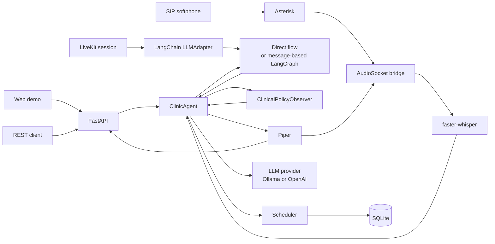
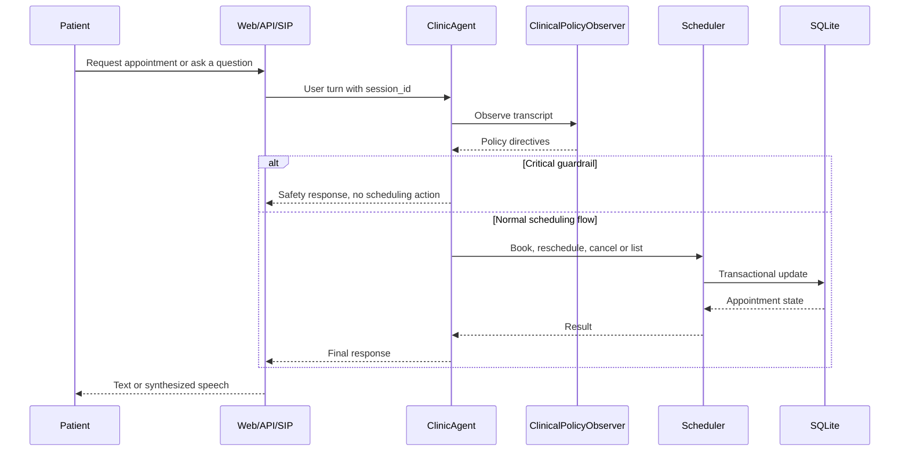
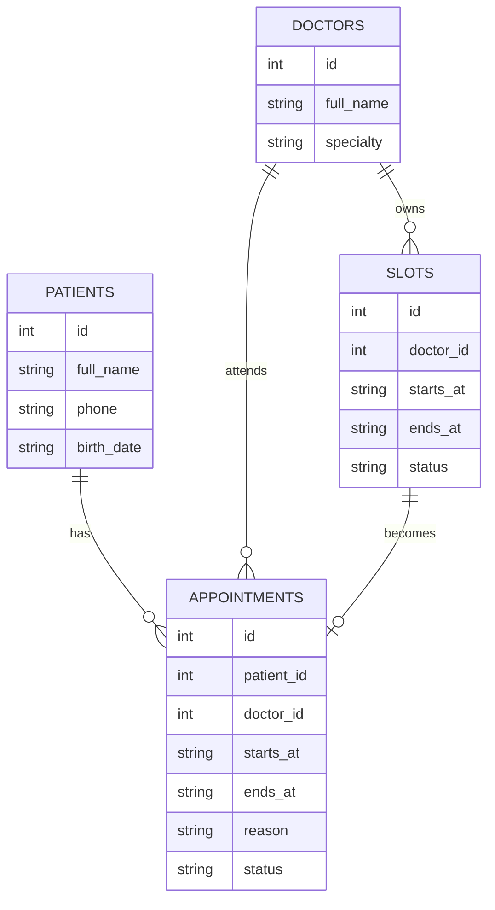
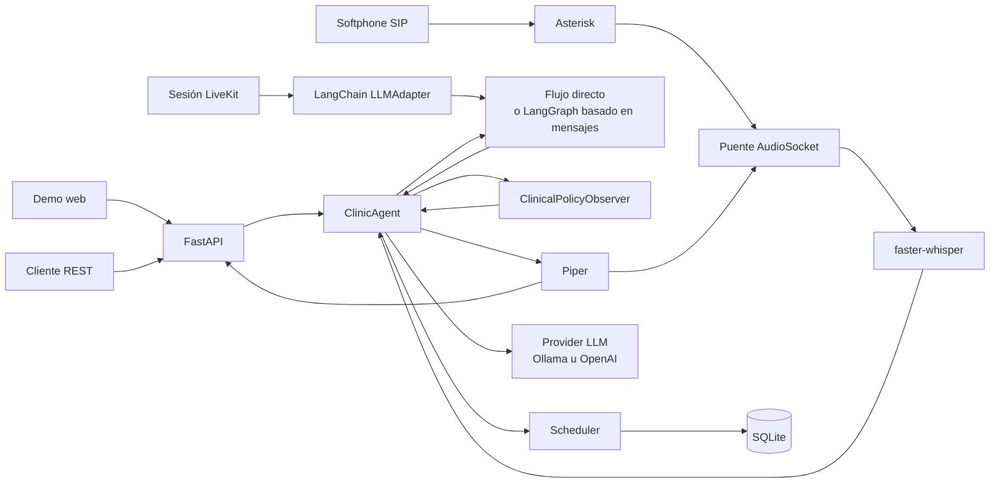

# Architecture / Arquitectura

## English

VoiceClinic is split into small, replaceable layers. The scheduling domain does
not know whether a request came from the web demo, a REST call, a SIP call or a
future LiveKit session. That keeps the core behavior testable and makes the voice
stack easier to evolve.

### System diagram

### Runtime flow

### Components

- `voiceclinic.api`: FastAPI app, web demo mount, chat endpoint, voice-turn endpoint.
- `voiceclinic.agent`: conversation logic, intent extraction and tool execution.
- `voiceclinic.orchestration`: optional message-based LangGraph graph for the
  turn lifecycle and LiveKit's LangChain adapter.
- `voiceclinic.llm`: OpenAI-compatible provider abstraction for Ollama and OpenAI.
- `voiceclinic.guardrails`: independent clinical policy observer.
- `voiceclinic.scheduling`: transactional appointment operations.
- `voiceclinic.db`: SQLite schema and demo seed data.
- `voiceclinic.voice`: local STT/TTS adapters.
- `voiceclinic.telephony`: Asterisk AudioSocket bridge.
- `voiceclinic.livekit_agent`: LiveKit adapter helper around the compiled
  LangGraph graph.

### Data model

### Design decisions

- **Local-first by default.** The project runs with local storage, local LLM
  inference and optional local speech components.
- **Rules before LLM for critical behavior.** Appointment operations are
  deterministic and covered by tests. Ollama improves language understanding but
  does not own the transaction.
- **Provider abstraction for LLMs.** The same agent can use local Ollama or the
  OpenAI provider through configuration.
- **Optional LangGraph orchestration.** The default direct flow is lightweight;
  LangGraph can be enabled to demonstrate explicit stateful orchestration. The
  graph uses a `messages` state key so LiveKit can wrap it with
  `langchain.LLMAdapter`.
- **Guardrails are a separate observer.** The clinical observer can block or
  annotate a turn before scheduling tools run.
- **SQLite for portfolio speed.** SQLite keeps the demo easy to run; the
  scheduler boundary makes a future Postgres migration straightforward.
- **Telephony is optional.** The API and web demo work without Asterisk, Piper or
  faster-whisper.

### Production gaps

- Identity verification is intentionally simplified.
- There is no real patient data, consent workflow or audit trail.
- Clinical guardrails are useful for a demo, but they are not a medical safety
  certification.
- Public telephone calls require a SIP trunk, which is not fully local.
- Low-latency voice in production would need stronger VAD, interruption handling
  and observability.

## Español

VoiceClinic está dividido en capas pequeñas y reemplazables. El dominio de
agenda no sabe si la petición llega desde la demo web, una llamada REST, una
llamada SIP o una futura sesión de LiveKit. Esto mantiene el núcleo fácil de
probar y permite evolucionar el stack de voz sin reescribir la lógica clínica.

### Diagrama del sistema

### Flujo de ejecución

### Componentes

- `voiceclinic.api`: aplicación FastAPI, demo web, endpoint de chat y endpoint de voz.
- `voiceclinic.agent`: lógica conversacional, extracción de intención y ejecución de herramientas.
- `voiceclinic.orchestration`: grafo opcional LangGraph basado en mensajes para
  el ciclo de turno y el adaptador LangChain de LiveKit.
- `voiceclinic.llm`: abstracción compatible con OpenAI para Ollama y OpenAI.
- `voiceclinic.guardrails`: observador clínico de políticas.
- `voiceclinic.scheduling`: operaciones transaccionales de agenda.
- `voiceclinic.db`: esquema SQLite y datos de demostración.
- `voiceclinic.voice`: adaptadores locales de STT/TTS.
- `voiceclinic.telephony`: puente AudioSocket para Asterisk.
- `voiceclinic.livekit_agent`: helper de LiveKit alrededor del grafo LangGraph
  compilado.

### Modelo de datos

### Decisiones técnicas

- **Local-first por defecto.** El proyecto usa almacenamiento local, inferencia
  local de LLM y componentes de voz locales opcionales.
- **Reglas antes que LLM para comportamiento crítico.** Las operaciones de agenda
  son deterministas y están cubiertas por tests. Ollama mejora la comprensión
  del lenguaje, pero no controla la transacción.
- **Abstracción de providers LLM.** El mismo agente puede usar Ollama local u
  OpenAI mediante configuración.
- **Orquestación opcional con LangGraph.** El flujo directo por defecto es ligero;
  LangGraph puede activarse para demostrar orquestación explícita con estado. El
  grafo usa la clave `messages` para que LiveKit pueda envolverlo con
  `langchain.LLMAdapter`.
- **Guardrails como observador separado.** El observador clínico puede bloquear o
  anotar un turno antes de ejecutar herramientas de agenda.
- **SQLite para velocidad de portfolio.** SQLite facilita ejecutar la demo; la
  frontera del scheduler permite migrar a Postgres más adelante.
- **Telefonía opcional.** La API y la demo web funcionan sin Asterisk, Piper ni
  faster-whisper.

### Brechas antes de producción

- La verificación de identidad está simplificada.
- No hay datos reales de pacientes, flujo de consentimiento ni auditoría completa.
- Los guardrails clínicos son útiles para la demo, pero no certifican seguridad médica.
- Las llamadas a red pública requieren un trunk SIP externo, por lo que no serían
  completamente locales.
- Voz de baja latencia en producción exigiría mejor VAD, manejo de interrupciones
  y observabilidad.
