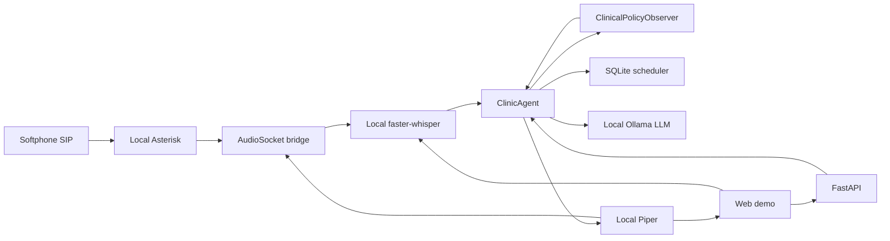

# Architecture / Arquitectura

## English

### Layers

1. `voiceclinic.scheduling`: transactional scheduling rules.
2. `voiceclinic.agent`: intent interpretation, tools and final response.
3. `voiceclinic.guardrails`: background-style clinical policy observer.
4. `voiceclinic.api`: REST API, web demo and voice-turn endpoint.
5. `voiceclinic.telephony.audiosocket_server`: local SIP bridge.
6. `voiceclinic.livekit_agent`: extension point for LiveKit Agents.

### Decisions

- SQLite keeps the portfolio project easy to run. Moving to Postgres would not
  change the agent contract.
- The agent does not depend on an LLM for critical operations: deterministic
  rules keep the offline demo and tests stable.
- Clinical guardrails are separated from appointment handling through a
  `ClinicalPolicyObserver`. This follows the LiveKit observer-pattern idea:
  listen to user turns, evaluate policy, then inject an actionable directive.
- Ollama is used as an optional natural-language interpretation layer.
- Asterisk/AudioSocket enables local SIP calls. LiveKit remains the next step
  for a self-hosted WebRTC/SIP architecture.

### Real Risks

- Latency: local STT + LLM + TTS can feel slow on CPU-only machines.
- VAD: the AudioSocket silence detector is intentionally simple.
- Clinical safety: there is no real PHI, recording consent flow or full audit
  trail in this demo. Guardrails reduce obvious risk, but they are not a medical
  safety certification.
- PSTN telephony: public-network calls require an external SIP trunk, which is
  no longer fully local.

## Espanol

### Capas

1. `voiceclinic.scheduling`: reglas transaccionales de agenda.
2. `voiceclinic.agent`: interpretacion de intencion, herramientas y respuesta final.
3. `voiceclinic.guardrails`: observador clinico de politicas.
4. `voiceclinic.api`: API REST, demo web y endpoint de turno de voz.
5. `voiceclinic.telephony.audiosocket_server`: puente SIP local.
6. `voiceclinic.livekit_agent`: punto de extension para LiveKit Agents.

### Decisiones

- SQLite mantiene el proyecto facil de ejecutar en portfolio. Cambiar a Postgres
  no afectaria al contrato del agente.
- El agente no depende de un LLM para operaciones criticas: las reglas
  deterministas mantienen estable la demo offline y los tests.
- Los guardrails clinicos estan separados de la gestion de citas mediante un
  `ClinicalPolicyObserver`. Sigue la idea del observer pattern de LiveKit:
  escuchar turnos de usuario, evaluar politica e inyectar una directiva accionable.
- Ollama se usa como capa opcional de interpretacion de lenguaje natural.
- Asterisk/AudioSocket permite llamadas SIP locales. LiveKit queda como el
  siguiente paso para una arquitectura WebRTC/SIP self-hosted.

### Riesgos Reales

- Latencia: STT + LLM + TTS local puede sentirse lento en maquinas solo con CPU.
- VAD: el detector de silencio del puente AudioSocket es deliberadamente simple.
- Seguridad clinica: esta demo no incluye PHI real, flujo de consentimiento de
  grabacion ni auditoria completa. Los guardrails reducen riesgos obvios, pero
  no son una certificacion de seguridad medica.
- Telefonia PSTN: las llamadas a red publica requieren un trunk SIP externo, por
  lo que ya no serian 100% locales.
