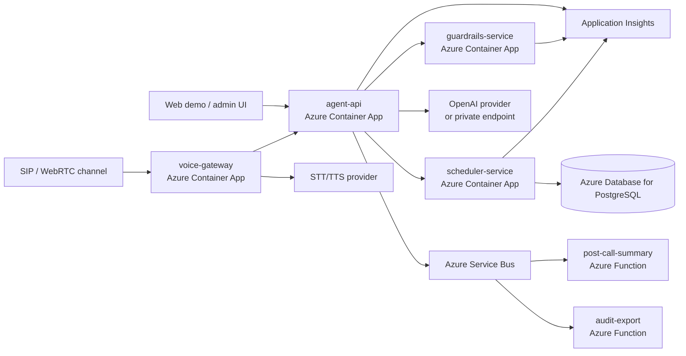
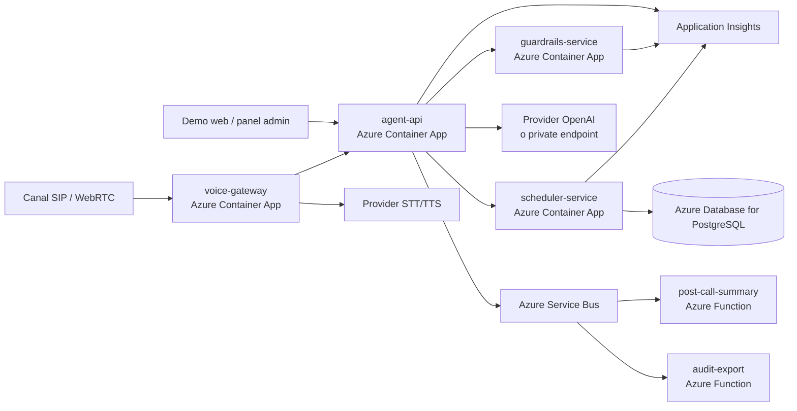

# Azure Architecture / Arquitectura Azure

## English

The local project is intentionally self-hosted, but the same boundaries map
cleanly to an Azure enterprise deployment. This document describes the target
architecture for Azure Container Apps, Azure Functions and Azure DevOps.

### Target Diagram

### Azure Container Apps

Container Apps are the natural target for long-running HTTP services:

- `agent-api`: receives chat/voice turns and orchestrates the conversation.
- `scheduler-service`: owns appointment transactions and database access.
- `guardrails-service`: evaluates clinical policy events.
- `voice-gateway`: bridges SIP/WebRTC audio to STT/TTS and the agent API.

Each service can scale independently. For a real deployment, secrets should come
from Key Vault or managed identities rather than `.env` files.

### Azure Functions

Azure Functions are best suited for short, event-driven jobs:

- post-call summaries;
- audit exports;
- notification fan-out;
- transcript redaction;
- asynchronous integration with external hospital systems.

The application can emit events to Azure Service Bus after each call or
appointment operation. Functions consume those events without blocking the voice
conversation.

### Azure DevOps

The repository includes `azure-pipelines.yml` as a template:

1. validate Python tests and lint;
2. validate Docker Compose files;
3. build and push the Docker image to Azure Container Registry;
4. update the Azure Container App revision.

Deployment variables are intentionally empty in the template. Configure them in
Azure DevOps variable groups:

- `azureServiceConnection`
- `acrName`
- `resourceGroup`
- `containerAppName`

### Local-To-Azure Mapping

| Local module | Azure target |
| --- | --- |
| `voiceclinic.api` | `agent-api` Container App |
| `voiceclinic.scheduling` | `scheduler-service` Container App |
| `voiceclinic.guardrails` | `guardrails-service` Container App |
| `voiceclinic.telephony` | `voice-gateway` Container App |
| SQLite | Azure Database for PostgreSQL |
| Local logs | Application Insights |
| Local background work | Azure Functions + Service Bus |

## Español

El proyecto local está pensado para ejecutarse de forma self-hosted, pero sus
fronteras encajan bien con un despliegue empresarial en Azure. Este documento
describe la arquitectura objetivo con Azure Container Apps, Azure Functions y
Azure DevOps.

### Diagrama objetivo

### Azure Container Apps

Container Apps es el destino natural para servicios HTTP de larga duración:

- `agent-api`: recibe turnos de chat/voz y orquesta la conversación.
- `scheduler-service`: controla transacciones de agenda y acceso a base de datos.
- `guardrails-service`: evalúa eventos de política clínica.
- `voice-gateway`: conecta audio SIP/WebRTC con STT/TTS y la API del agente.

Cada servicio puede escalar de forma independiente. En un despliegue real, los
secretos deberían venir de Key Vault o identidades administradas, no de archivos
`.env`.

### Azure Functions

Azure Functions encaja mejor para trabajos cortos y orientados a eventos:

- resúmenes posteriores a la llamada;
- exportaciones de auditoría;
- envío de notificaciones;
- anonimización de transcripts;
- integración asíncrona con sistemas hospitalarios externos.

La aplicación puede emitir eventos a Azure Service Bus después de cada llamada u
operación de agenda. Las Functions consumen esos eventos sin bloquear la
conversación de voz.

### Azure DevOps

El repositorio incluye `azure-pipelines.yml` como plantilla:

1. valida tests y lint de Python;
2. valida los archivos de Docker Compose;
3. construye y sube la imagen Docker a Azure Container Registry;
4. actualiza la revisión de Azure Container Apps.

Las variables de despliegue están vacías de forma intencionada. Configúralas en
grupos de variables de Azure DevOps:

- `azureServiceConnection`
- `acrName`
- `resourceGroup`
- `containerAppName`

### Mapeo local a Azure

| Módulo local | Destino Azure |
| --- | --- |
| `voiceclinic.api` | Container App `agent-api` |
| `voiceclinic.scheduling` | Container App `scheduler-service` |
| `voiceclinic.guardrails` | Container App `guardrails-service` |
| `voiceclinic.telephony` | Container App `voice-gateway` |
| SQLite | Azure Database for PostgreSQL |
| Logs locales | Application Insights |
| Trabajo en segundo plano | Azure Functions + Service Bus |
