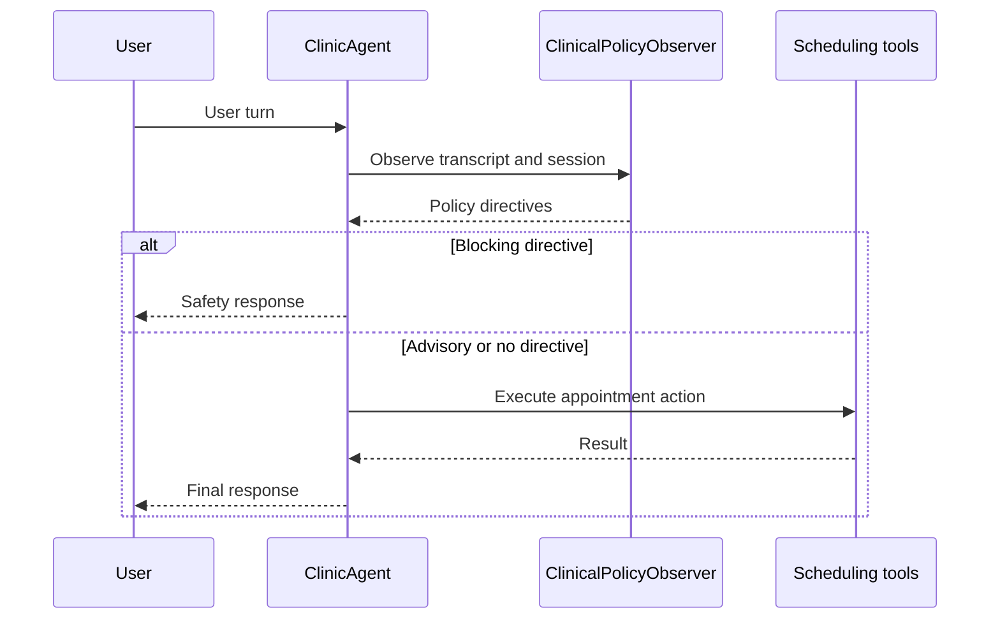
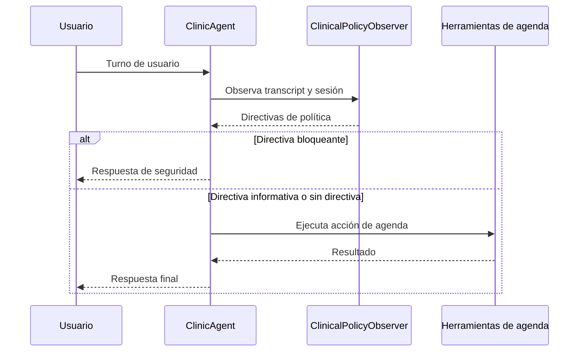

# Guardrails / Guardrails Clínicos

## English

VoiceClinic implements a local clinical observer inspired by LiveKit's background
observer pattern for voice-agent guardrails.

The key idea is separation of concerns: the appointment agent focuses on the
conversation and tool execution, while a policy observer reviews each user turn
and injects safety directives before any scheduling action runs.

### Pattern

### Current policies

- `medical_emergency`: detects signals such as chest pain, breathing difficulty,
  stroke/heart-attack language, fainting, seizures or heavy bleeding. It blocks
  routine booking and directs the caller to emergency care.
- `self_harm`: detects self-harm or suicidal ideation. It blocks normal
  appointment handling and recommends immediate emergency support.
- `diagnosis_request`: detects requests for diagnosis or clinical interpretation.
  It blocks diagnosis and offers appointment scheduling instead.
- `prescription_request`: detects requests for medication, dosage or prescription
  instructions. It blocks medical advice and offers a clinician appointment.
- `third_party_data`: detects requests involving another patient's data. It adds
  a privacy warning before continuing.

### Why this matters

Prompt-only safety rules are fragile because they compete with the agent's main
task. A separate observer makes policy behavior explicit, testable and reusable
across web, API, SIP and future LiveKit channels.

### LiveKit integration path

The current implementation is independent from LiveKit. In a future LiveKit
Agents version, the same observer can be fed from `conversation_item_added` once
the user's speech has been committed to the conversation.

Reference: https://livekit.com/blog/observer-pattern-voice-agent-guardrails

## Español

VoiceClinic implementa un observador clínico local inspirado en el patrón de
background observer de LiveKit para guardrails de agentes de voz.

La idea principal es separar responsabilidades: el agente de citas se concentra
en la conversación y la ejecución de herramientas, mientras que un observador de
políticas revisa cada turno del usuario e inyecta directivas de seguridad antes
de ejecutar cualquier acción de agenda.

### Patrón

### Políticas actuales

- `medical_emergency`: detecta señales como dolor torácico, dificultad
  respiratoria, lenguaje de ictus/infarto, desmayos, convulsiones o sangrado
  abundante. Bloquea la reserva ordinaria y deriva a atención urgente.
- `self_harm`: detecta autolesión o ideación suicida. Bloquea la gestión normal
  de citas y recomienda ayuda urgente.
- `diagnosis_request`: detecta peticiones de diagnóstico o interpretación
  clínica. Bloquea el diagnóstico y ofrece reservar una cita.
- `prescription_request`: detecta peticiones de medicación, dosis o receta.
  Bloquea el consejo médico y ofrece cita con un profesional.
- `third_party_data`: detecta peticiones relacionadas con datos de otro paciente.
  Añade una advertencia de privacidad antes de continuar.

### Por qué importa

Las reglas de seguridad escritas solo en el prompt son frágiles porque compiten
con el objetivo principal del agente. Un observador separado hace que las
políticas sean explícitas, testeables y reutilizables en web, API, SIP y futuros
canales con LiveKit.

### Camino de integración con LiveKit

La implementación actual no depende de LiveKit. En una versión futura con
LiveKit Agents, el mismo observador puede alimentarse desde
`conversation_item_added` cuando el turno de voz del usuario ya esté confirmado
en la conversación.

Referencia: https://livekit.com/blog/observer-pattern-voice-agent-guardrails
