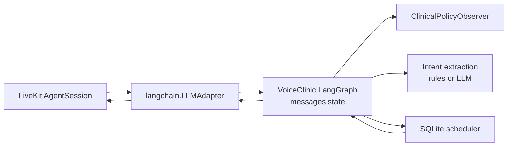
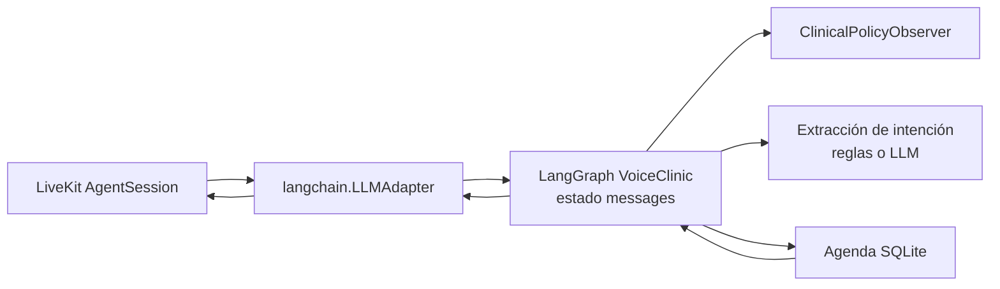

# LiveKit + LangGraph / LiveKit + LangGraph

## English

This project follows the LiveKit LangChain adapter pattern: the clinic workflow
is exposed as a compiled LangGraph graph, and LiveKit can wrap that graph with
`livekit.plugins.langchain.LLMAdapter`. LiveKit handles the real-time voice
pipeline, while VoiceClinic keeps ownership of appointment logic, guardrails and
local provider configuration.

### Why the graph is message-based

LiveKit's adapter sends chat context to LangGraph as:

```python
{"messages": messages}
```

For that reason, the VoiceClinic LangGraph state includes a `messages` key and
uses LangGraph's message reducer. The graph appends only the final
patient-facing `AIMessage` after each turn, so internal appointment metadata and
guardrail data are kept in `additional_kwargs` instead of being spoken by TTS.

### Implemented flow



The graph still follows the same domain sequence used by the local API:

```text
observe_policy -> infer_intent -> execute_action
```

If the clinical observer raises a blocking policy, the graph stops before
running any scheduling operation and returns the safety response as the final
`AIMessage`.

### Setup

Install the LiveKit and LangGraph optional dependencies:

```bash
python scripts/dev.py setup-livekit
```

For a complete local environment with voice, orchestration and LiveKit extras:

```bash
python scripts/dev.py setup-all
```

Recommended local LLM configuration:

```env
ORCHESTRATION_MODE=langgraph
LLM_PROVIDER=ollama
OLLAMA_BASE_URL=http://localhost:11434/v1
OLLAMA_MODEL=qwen3:30b
```

### Using the graph with LiveKit

The repo exposes two integration points:

- `voiceclinic.orchestration.build_livekit_graph(agent)` returns the compiled
  LangGraph graph.
- `voiceclinic.livekit_agent.build_langgraph_llm_adapter()` returns a LiveKit
  `LLMAdapter` around that graph.

Minimal LiveKit usage:

```python
from livekit.agents import AgentSession
from livekit.plugins import langchain

from voiceclinic.agent import ClinicAgent
from voiceclinic.config import load_settings
from voiceclinic.orchestration import build_livekit_graph

settings = load_settings()
agent = ClinicAgent(settings.db_path, settings=settings)
graph = build_livekit_graph(agent)

session = AgentSession(
    llm=langchain.LLMAdapter(graph=graph),
    # stt=..., tts=..., vad=...
)
```

The helper in `voiceclinic.livekit_agent` builds the same adapter directly:

```python
from livekit.agents import AgentSession

from voiceclinic.livekit_agent import build_langgraph_llm_adapter

session = AgentSession(
    llm=build_langgraph_llm_adapter(),
    # stt=..., tts=..., vad=...
)
```

### Validation

Run:

```bash
python scripts/dev.py test
python scripts/dev.py lint
```

The test suite verifies that the compiled graph accepts `HumanMessage` input,
returns a final `AIMessage`, supports `stream_mode="messages"` and blocks
emergency requests before scheduling.

### References

- LiveKit blog: https://livekit.com/blog/langchain-to-livekit
- LiveKit LangChain integration guide: https://docs.livekit.io/agents/models/llm/langchain/

## Español

Este proyecto sigue el patrón del adaptador LangChain de LiveKit: el flujo de la
clínica se expone como un grafo LangGraph compilado, y LiveKit puede envolver ese
grafo con `livekit.plugins.langchain.LLMAdapter`. LiveKit gestiona la tubería de
voz en tiempo real, mientras VoiceClinic mantiene la lógica de citas, guardrails
y configuración local de providers.

### Por qué el grafo usa mensajes

El adaptador de LiveKit envía el contexto conversacional a LangGraph como:

```python
{"messages": messages}
```

Por eso el estado de LangGraph en VoiceClinic incluye una clave `messages` y usa
el reducer de mensajes de LangGraph. El grafo solo añade el `AIMessage` final que
debe escuchar el paciente; los metadatos internos de agenda y guardrails quedan
en `additional_kwargs` para que no se lean por TTS.

### Flujo implementado



El grafo conserva la misma secuencia de dominio que usa la API local:

```text
observe_policy -> infer_intent -> execute_action
```

Si el observador clínico detecta una política bloqueante, el grafo se detiene
antes de ejecutar cualquier acción de agenda y devuelve la respuesta de seguridad
como `AIMessage` final.

### Instalación

Instala las dependencias opcionales de LiveKit y LangGraph:

```bash
python scripts/dev.py setup-livekit
```

Para un entorno local completo con voz, orquestación y extras de LiveKit:

```bash
python scripts/dev.py setup-all
```

Configuración recomendada para LLM local:

```env
ORCHESTRATION_MODE=langgraph
LLM_PROVIDER=ollama
OLLAMA_BASE_URL=http://localhost:11434/v1
OLLAMA_MODEL=qwen3:30b
```

### Uso del grafo con LiveKit

El repo expone dos puntos de integración:

- `voiceclinic.orchestration.build_livekit_graph(agent)` devuelve el grafo
  LangGraph compilado.
- `voiceclinic.livekit_agent.build_langgraph_llm_adapter()` devuelve un
  `LLMAdapter` de LiveKit envolviendo ese grafo.

Uso mínimo con LiveKit:

```python
from livekit.agents import AgentSession
from livekit.plugins import langchain

from voiceclinic.agent import ClinicAgent
from voiceclinic.config import load_settings
from voiceclinic.orchestration import build_livekit_graph

settings = load_settings()
agent = ClinicAgent(settings.db_path, settings=settings)
graph = build_livekit_graph(agent)

session = AgentSession(
    llm=langchain.LLMAdapter(graph=graph),
    # stt=..., tts=..., vad=...
)
```

El helper de `voiceclinic.livekit_agent` crea el mismo adapter directamente:

```python
from livekit.agents import AgentSession

from voiceclinic.livekit_agent import build_langgraph_llm_adapter

session = AgentSession(
    llm=build_langgraph_llm_adapter(),
    # stt=..., tts=..., vad=...
)
```

### Validación

Ejecuta:

```bash
python scripts/dev.py test
python scripts/dev.py lint
```

La suite comprueba que el grafo compilado acepta entrada `HumanMessage`, devuelve
un `AIMessage` final, soporta `stream_mode="messages"` y bloquea peticiones de
urgencia antes de tocar la agenda.

### Referencias

- Blog de LiveKit: https://livekit.com/blog/langchain-to-livekit
- Guía de integración LangChain de LiveKit: https://docs.livekit.io/agents/models/llm/langchain/
